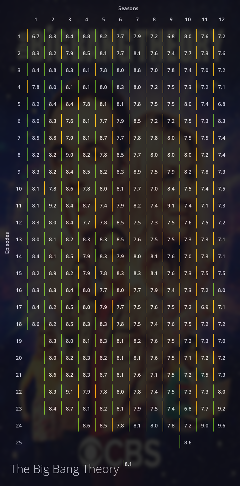

# Ratrix
A python script to generate episode vs season ratings matrix for your favourite show.

Requires `requests` and `pillow`.

```
$ pip install requests
$ pip install pillow
```

This program interacts with the OMDb API for the statistics, and contains a default 
API key inside `.apikey` file. OMDb has a limit of 1000 requests per day for free API 
users. So in case that limit is reached, create a new key for yourself at omdb.com and 
store it inside the `.apikey` file, and then continue using Ratrix as usual.

# Usage
```
$ ratrix "This Is Us" this_is_us.png
```

# Screenshots



